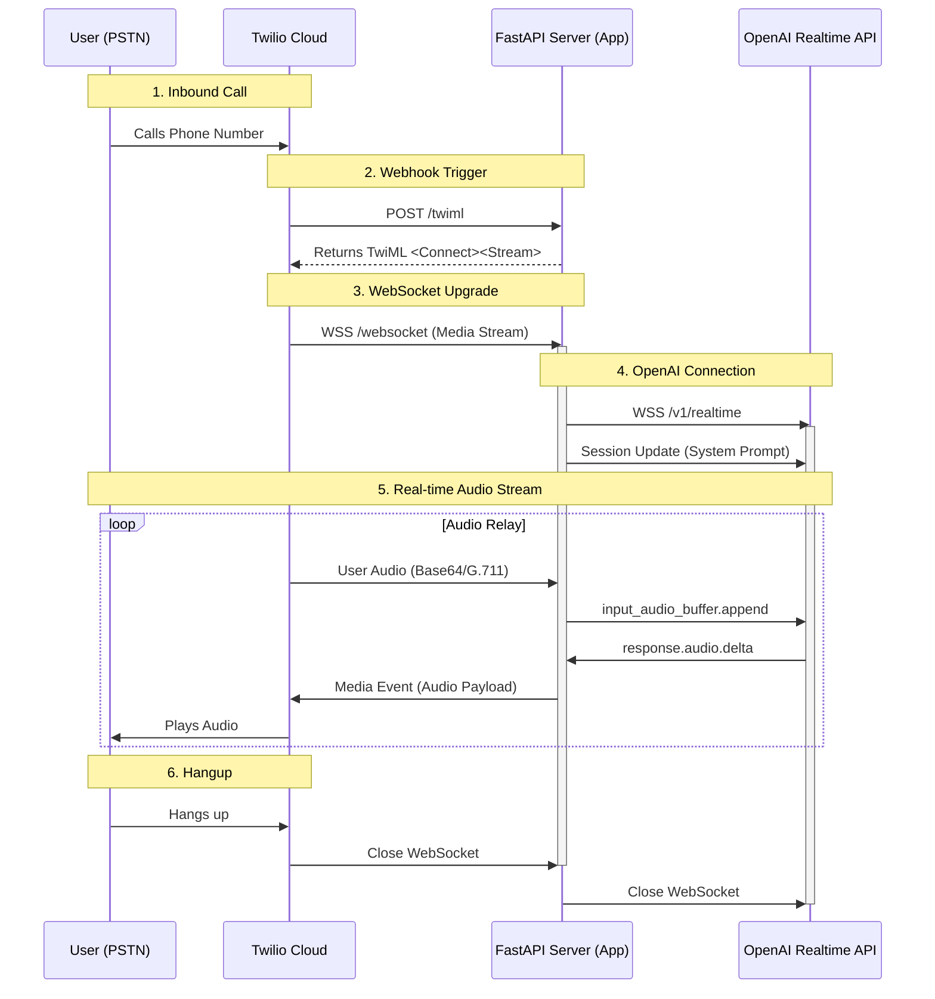

# System Architecture: LLM Voice Assistant

This document outlines the architecture of the real-time voice assistant, explaining how audio flows between the user's phone, Twilio, our application server, and OpenAI.

## High-Level Data Flow

## Deep Dive & Glossary

### 1. PSTN (Public Switched Telephone Network)
**"The Old-School Phone Grid"**
*   **What it is:** The aggregate of the world's circuit-switched telephone networks. It's the physical infrastructure of copper wires, fiber optic cables, microwave transmission links, and cellular networks that allows you to call your grandma on her landline or your friend on their mobile.
*   **Role here:** The user starts here. When they dial your number, the signal travels through their carrier (e.g., AT&T, Vodafone) across the PSTN until it reaches Twilio.

### 2. Twilio
**"The Bridge between Phone Lines and the Internet"**
*   **What it is:** A Cloud Communications Platform (CPaaS). It owns connections to the PSTN carriers and exposes them as HTTP APIs.
*   **How it works:**
    *   Historically, connecting a computer to a phone line required expensive hardware cards. Twilio virtualizes this.
    *   When a call comes in from the PSTN, Twilio converts that analog/digital phone signal into an HTTP request (a "Webhook") to your server.
*   **TwiML (Twilio Markup Language):** An XML format (looks like HTML) that tells Twilio what to do. In our app, we send `<Connect><Stream>` to tell Twilio: *"Stop thinking like a phone, and start streaming raw audio to this WebSocket URL."*

### 3. Webhook
**"Don't call us, we'll call you"**
*   **What it is:** A way for an app to provide other applications with real-time information.
*   **Context:** Instead of our server constantly asking Twilio "Is there a call? Is there a call?", Twilio creates a `POST` request to our `/twiml` URL only when a call actually happens.

### 4. WebSocket (WSS)
**"The Two-Way Street"**
*   **What it is:** A persistent, full-duplex communication channel over a single TCP connection.
*   **Why we need it:** 
    *   HTTP (standard web requests) is "request-response" (Walkie-Talkie style: "Over."). 
    *   Voice conversation is continuous (Telephone style). We need to send and receive audio data simultaneously and instantly. WebSockets allow this constant flow of data packets without the overhead of opening a new request for every word.

### 5. G.711 (µ-law / a-law)
**"The Audio Format"**
*   **What it is:** A standard pulse code modulation (PCM) algorithm for encoding analog audio signals. It is the standard codec for landline telephones.
*   **Context:** Twilio sends us audio in this specific format (8000Hz sample rate). We have to tell OpenAI that the audio coming in is `g711_ulaw` so it knows how to decode it.

### 6. VAD (Voice Activity Detection)
**"Knowing when to shut up"**
*   **What it is:** The ability of the AI to distinguish between background noise and actual human speech.
*   **Context:** OpenAI's "Server VAD" listens to the audio stream. When it detects speech, it automatically interrupts itself (stops generating audio) so it can listen to the user, mimicking a natural human interruption.

### 7. Latency
**"The Lag"**
*   **What it is:** The time delay between the user speaking and hearing a response.
*   **Challenge:** In Voice AI, high latency kills the illusion. We fight latency by:
    *   Using **WebSockets** (lowest network overhead).
    *   Using **Streaming** (OpenAI sends the beginning of the sentence before it has finished thinking of the end).
    *   Hosting servers geographically close to the user/Twilio.
