# LLM via Voicecall - Codebase Explanation

> A real-time AI voice assistant application that bridges Twilio phone calls with OpenAI's Realtime API, enabling users to have voice conversations with an AI chatbot over the phone.

---

## Table of Contents

1. [Overview](#overview)
2. [Architecture Diagram](#architecture-diagram)
3. [Technology Stack](#technology-stack)
4. [Project Structure](#project-structure)
5. [Component Breakdown](#component-breakdown)
6. [Data Flow](#data-flow)
7. [How Components Connect](#how-components-connect)
8. [Configuration & Environment](#configuration--environment)
9. [Running the Application](#running-the-application)

---

## Overview

This application creates a **real-time voice AI assistant** that:

1. Receives incoming phone calls via **Twilio**
2. Initiates outbound phone calls to users via **Twilio**
3. Streams audio bidirectionally between the phone call and **OpenAI's Realtime API**
4. Uses **OpenAI's GPT-4o Realtime** model for natural voice conversations

The core innovation is the **WebSocket bridge** that connects Twilio's Media Streams (phone audio) with OpenAI's Realtime API (AI audio), enabling seamless real-time voice conversations.

---

## Architecture Diagram

```mermaid
flowchart TB
    subgraph User
        Phone["📱 Phone"]
    end
    
    subgraph Twilio["Twilio Cloud"]
        TwilioAPI["Twilio API"]
        MediaStream["Media Stream<br/>(WebSocket)"]
    end
    
    subgraph Server["FastAPI Server"]
        Main["main.py<br/>Entry Point"]
        API["api.py<br/>Routes"]
        VoiceHandler["voice_handler.py<br/>WebSocket Bridge"]
        Config["config.py<br/>Settings"]
    end
    
    subgraph OpenAI["OpenAI Cloud"]
        RealtimeAPI["Realtime API<br/>(GPT-4o)"]
    end
    
    subgraph Scripts
        OutboundCall["outbound_call.py<br/>Initiates Calls"]
    end
    
    Phone <-->|"Voice Call"| TwilioAPI
    TwilioAPI -->|"HTTP POST /twiml"| API
    API -->|"TwiML Response"| TwilioAPI
    TwilioAPI <-->|"WebSocket Audio"| MediaStream
    MediaStream <-->|"WebSocket /websocket"| VoiceHandler
    VoiceHandler <-->|"WebSocket"| RealtimeAPI
    
    OutboundCall -->|"REST API"| TwilioAPI
    Main --> API
    Config --> VoiceHandler
    Config --> Main
```



---

## Technology Stack

| Technology | Purpose |
|------------|---------|
| **FastAPI** | Python web framework for REST API and WebSocket endpoints |
| **Uvicorn** | ASGI server to run the FastAPI application |
| **Twilio** | Phone call handling (PSTN), media streams |
| **OpenAI Realtime API** | GPT-4o real-time voice AI model |
| **WebSockets** | Bidirectional real-time audio streaming |
| **python-dotenv** | Environment variable management |

### Dependencies (`requirements.txt`)

```text
fastapi      # Web framework
uvicorn      # ASGI server
twilio       # Twilio SDK for call management
python-dotenv # Environment variable loading
websockets   # WebSocket client library
```

---

## Project Structure

```
LLM via WhatsApp/
├── .env.local                 # Environment variables (secrets)
├── main.py                    # Application entry point
├── outbound_call.py           # Script to initiate outbound calls
├── requirements.txt           # Python dependencies
├── twilio_architecture.drawio # Architecture diagram (draw.io)
└── app/
    ├── __init__.py           # Package marker
    ├── config.py             # Configuration and settings
    ├── api.py                # FastAPI routes and endpoints
    └── voice_handler.py      # WebSocket bridge (Twilio ↔ OpenAI)
```

---

## Component Breakdown

### 1. `main.py` - Application Entry Point

**Purpose:** Initializes and runs the FastAPI application.

```python
from fastapi import FastAPI
from app.config import PORT
from app.api import router

app = FastAPI()
app.include_router(router)

if __name__ == "__main__":
    import uvicorn
    uvicorn.run(app, host="0.0.0.0", port=PORT)
```

**Key Responsibilities:**
- Creates the FastAPI application instance
- Includes the API router with all endpoints
- Starts the Uvicorn server on the configured port

---

### 2. `app/config.py` - Configuration Module

**Purpose:** Centralizes all configuration, environment variables, and constants.

**Key Settings:**

| Variable | Description |
|----------|-------------|
| `OPENAI_API_KEY` | API key for OpenAI Realtime API |
| `PORT` | Server port (default: 5050) |
| `SYSTEM_MESSAGE` | AI chatbot personality/instructions |
| `VOICE` | OpenAI TTS voice (e.g., "alloy") |
| `LOG_EVENT_TYPES` | Events to log for debugging |

**System Message:**
```python
SYSTEM_MESSAGE = (
    "You are Chatbot, an AI assistant. "
    "You are helpful, concise, and professional."
)
```

---

### 3. `app/api.py` - API Routes

**Purpose:** Defines all HTTP and WebSocket endpoints.

#### Endpoints:

| Endpoint | Method | Purpose |
|----------|--------|---------|
| `/` | GET | Health check - returns status page |
| `/twiml` | POST | Twilio webhook - returns TwiML to connect Media Stream |
| `/websocket` | WebSocket | Handles Twilio Media Stream connection |

#### `/twiml` Endpoint (Critical)

When Twilio receives a call, it hits this endpoint. The response is **TwiML** (Twilio Markup Language) that instructs Twilio to:

1. Say "Connected to Chatbot" (greeting)
2. Open a WebSocket connection to `/websocket` for audio streaming

```python
@router.post("/twiml")
async def twiml_response(request: Request):
    response = VoiceResponse()
    response.say("Connected to Chatbot.")
    connect = Connect()
    connect.stream(url=f"wss://{host}/websocket")
    response.append(connect)
    return Response(content=str(response), media_type="application/xml")
```

#### `/websocket` Endpoint

Accepts the WebSocket connection from Twilio and delegates all logic to `VoiceEventHandler`:

```python
@router.websocket("/websocket")
async def websocket_endpoint(websocket: WebSocket):
    await websocket.accept()
    handler = VoiceEventHandler(websocket)
    await handler.start()
```

---

### 4. `app/voice_handler.py` - The Heart of the Application

**Purpose:** Acts as a **bidirectional bridge** between Twilio's Media Stream and OpenAI's Realtime API.

#### Class: `VoiceEventHandler`

```mermaid
sequenceDiagram
    participant Phone
    participant Twilio
    participant VoiceHandler
    participant OpenAI
    
    Phone->>Twilio: User speaks
    Twilio->>VoiceHandler: Audio (G.711 μ-law, base64)
    VoiceHandler->>OpenAI: input_audio_buffer.append
    OpenAI->>OpenAI: Process with GPT-4o
    OpenAI->>VoiceHandler: response.audio.delta
    VoiceHandler->>Twilio: media event (base64 audio)
    Twilio->>Phone: AI speaks
```



#### Key Methods:

##### `start()`
- Connects to OpenAI Realtime API via WebSocket
- Initializes the session with configuration
- Creates two concurrent tasks:
  - `receive_from_twilio()` - Listens for audio from phone
  - `receive_from_openai()` - Listens for responses from AI

##### `initialize_session()`
Configures the OpenAI Realtime session:

```python
session_update = {
    "type": "session.update",
    "session": {
        "turn_detection": {"type": "server_vad"},  # Voice Activity Detection
        "input_audio_format": "g711_ulaw",          # Twilio audio format
        "output_audio_format": "g711_ulaw",         # Output format for Twilio
        "voice": VOICE,                             # AI voice
        "instructions": SYSTEM_MESSAGE,             # AI personality
        "modalities": ["text", "audio"],            # Enable both modalities
        "temperature": 0.8,                         # Response creativity
    }
}
```

##### `receive_from_twilio()`
Processes incoming Twilio Media Stream events:

| Event | Action |
|-------|--------|
| `media` | Forwards base64 audio to OpenAI |
| `start` | Records the `streamSid` for responses |
| `stop` | Terminates the connection |

##### `receive_from_openai()`
Processes OpenAI Realtime API events:

| Event | Action |
|-------|--------|
| `session.created` | Confirms connection |
| `response.audio.delta` | Forwards audio to Twilio |
| `response.audio.done` | Logs completion |
| `error` | Logs error details |

---

### 5. `outbound_call.py` - Outbound Call Initiator

**Purpose:** A standalone script to initiate calls TO users (rather than receiving calls).

**How it works:**
1. Loads Twilio credentials from `.env.local`
2. Uses Twilio REST API to create a call
3. Points the call's URL to `/twiml` on your server
4. When the call is answered, Twilio fetches TwiML and connects to the AI

```python
call = client.calls.create(
    url=f"{server_url}/twiml",  # Webhook URL
    to=to_number,                # Destination phone number
    from_=from_number,           # Your Twilio number
)
```

---

## Data Flow

### Incoming Call Flow

```mermaid
flowchart LR
    A["📱 User calls<br/>Twilio number"] --> B["Twilio receives call"]
    B --> C["POST /twiml"]
    C --> D["Return TwiML"]
    D --> E["Twilio opens<br/>WebSocket"]
    E --> F["VoiceHandler<br/>connects to OpenAI"]
    F --> G["Bidirectional<br/>audio streaming"]
```



### Audio Stream Flow

```mermaid
flowchart TB
    subgraph "User → AI"
        A1["User speaks"] --> A2["Phone encodes audio"]
        A2 --> A3["Twilio streams<br/>(G.711 μ-law, base64)"]
        A3 --> A4["VoiceHandler receives"]
        A4 --> A5["Forward to OpenAI<br/>(input_audio_buffer.append)"]
    end
    
    subgraph "AI → User"
        B1["OpenAI processes"] --> B2["GPT-4o generates response"]
        B2 --> B3["Audio delta events"]
        B3 --> B4["VoiceHandler receives"]
        B4 --> B5["Forward to Twilio<br/>(media event)"]
        B5 --> B6["User hears AI"]
    end
```



---

## How Components Connect

### Connection Flow Diagram


### Import Dependencies

| File | Imports From |
|------|--------------|
| `main.py` | `app.config`, `app.api` |
| `app/api.py` | `app.voice_handler`, `app.config` (indirectly) |
| `app/voice_handler.py` | `app.config` |
| `outbound_call.py` | (standalone - reads `.env.local` directly) |

---

## Configuration & Environment

### Required Environment Variables (`.env.local`)

| Variable | Description | Example |
|----------|-------------|---------|
| `OPENAI_API_KEY` | Your OpenAI API key | `sk-...` |
| `TWILIO_ACCOUNT_SID` | Twilio Account SID | `AC...` |
| `TWILIO_AUTH_TOKEN` | Twilio Auth Token | `abc123...` |
| `TWILIO_PHONE_NUMBER` | Your Twilio phone number | `+1234567890` |
| `MY_PHONE_NUMBER` | Target phone for outbound calls | `+1987654321` |
| `SERVER_URL` | Public URL (ngrok) | `https://xxxx.ngrok.io` |
| `PORT` | Server port (optional) | `5050` |

### Audio Format

The application uses **G.711 μ-law** encoding:
- Standard telephony audio format
- 8kHz sample rate
- Matches Twilio's Media Stream format
- Compatible with OpenAI Realtime API

---

## Running the Application

### Prerequisites

1. **Python 3.9+** installed
2. **Twilio account** with a phone number
3. **OpenAI API key** with Realtime API access
4. **ngrok** or similar for exposing local server

### Setup Steps

```bash
# 1. Install dependencies
pip install -r requirements.txt

# 2. Configure environment variables
# Create .env.local with all required variables

# 3. Start ngrok to expose your server
ngrok http 5050

# 4. Update SERVER_URL in .env.local with ngrok URL

# 5. Start the server
python main.py

# 6. (Optional) Make an outbound call
python outbound_call.py
```

### Twilio Webhook Configuration

For **incoming calls**, configure your Twilio phone number:
- **Voice Webhook URL:** `https://your-ngrok-url.ngrok.io/twiml`
- **Method:** POST

---

## Summary

This codebase implements a **real-time voice AI system** with the following key architectural decisions:

1. **FastAPI for web framework** - Provides async support for WebSocket handling
2. **Modular design** - Separates concerns (config, routes, logic)
3. **Bidirectional WebSocket bridge** - Enables real-time audio streaming between Twilio and OpenAI
4. **G.711 μ-law audio** - Uses standard telephony format for compatibility
5. **Server-side VAD** - OpenAI handles voice activity detection for natural conversations

The `VoiceEventHandler` class is the **core component** that manages the complex task of bridging two different real-time audio protocols (Twilio Media Streams and OpenAI Realtime API).
